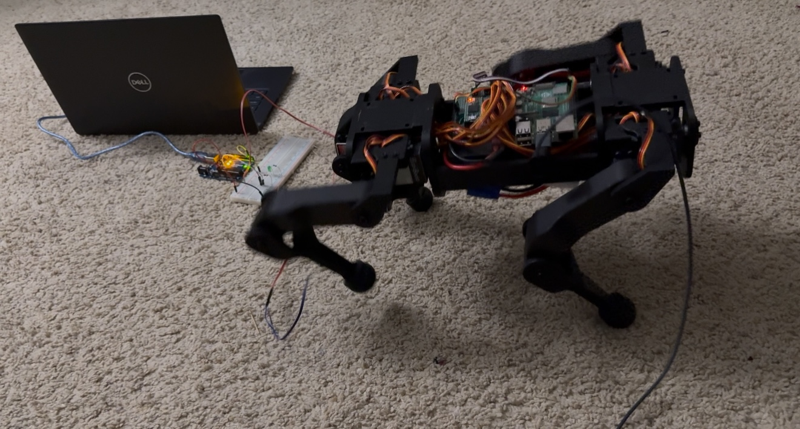
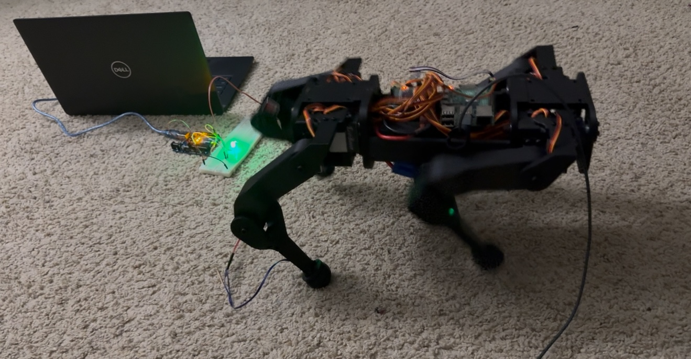

## Robot Dog Minimal

Inspired by [SpotMiniMini's](https://github.com/OpenQuadruped/spot_mini_mini) work on RL trained policies using only IMU, I wanted to explore the effect of ground reaction forces and contact sensing within a linear policy. My goal was to maintain low-cost robotic hardware while enabling the robot to handle terrain sensing autonomously.

### [Watch this video on YouTube](https://youtu.be/hBNCrke3qqk)

## Training
All three robot policies IMU, IMU+Contact and IMU+Force were trained on a higher and randomized terrain. The observation space for force policies consists of 24 inputs whereas IMU+Contacts - 16 inputs and IMU - 12 inputs.

## Contact Sensing

We explored various methods by which such contact estimation could be enabled. We chose an FSR with a small form factor (10mm X 20 mm) and a force sensing range of 0.2N to 20N. The FSR is sandwiched between the lower-leg and foot of the robot. The lower leg and foot are separated by 4 silicon O-rings when assembled. When the foot contacts the ground, the O-rings are compressed and the cylindrical boss of the foot applies force on the FSR, decreasing its resistance. When the foot breaks contact with the ground, the O-rings decompress, causing the foot to return to its original position. The force applied on the FSR is decreased, increasing its resistance. 

 

## Credits

* Original Spot Design and CAD files: [Spot Micro AI Community](https://spotmicroai.readthedocs.io/en/latest/)
* RL agent(https://github.com/OpenQuadruped/spot_mini_mini) OpenQuadruped Design - [Adham Elarabawy](https://github.com/adham-elarabawy/OpenQuadruped)

* Minimal Design and CAD files - Aniket Mandhare 

* OpenAI Gym and Heightfield Interface: [Minitaur Environment](https://github.com/bulletphysics/bullet3/blob/master/examples/pybullet/gym/pybullet_envs/bullet/minitaur.py)
